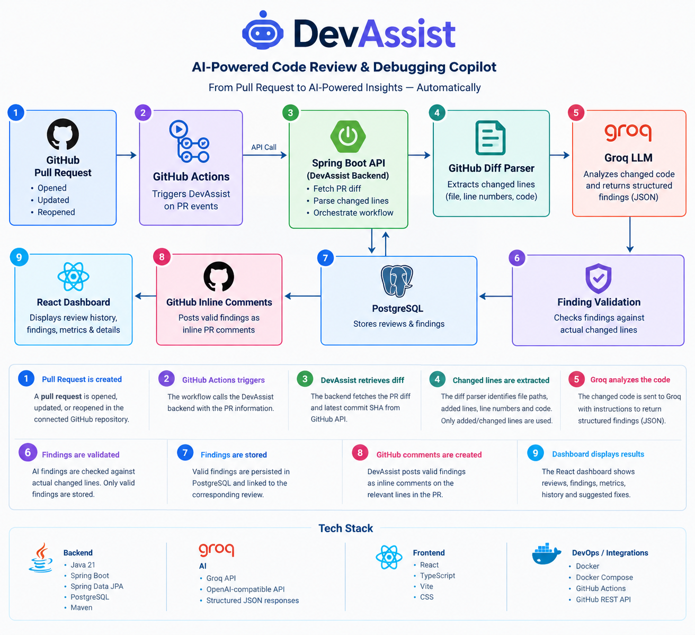

# DevAssist — AI-Powered Code Review & Debugging Copilot

DevAssist is a full-stack developer tool that integrates AI-powered code review into the GitHub pull request workflow.

It analyzes changed code using an LLM, identifies actionable issues, stores review findings, and posts inline comments directly on GitHub pull requests.

## Features

* AI-powered code review using Groq
* GitHub Pull Request integration
* Automatic review triggering through GitHub Actions
* Changed-line-aware analysis
* Validation of AI-generated findings against actual changed lines
* Inline GitHub PR comments
* PostgreSQL persistence for reviews and findings
* React + TypeScript dashboard
* Review history and finding details
* Dockerized PostgreSQL setup
* REST APIs using Spring Boot
* Automated backend tests with Maven

## Architecture



DevAssist follows an event-driven code review workflow where GitHub pull requests trigger GitHub Actions, which invoke the Spring Boot backend. The backend retrieves the PR diff, extracts changed lines, sends them to Groq for analysis, validates the generated findings, stores valid findings in PostgreSQL, and posts inline comments back to GitHub.

## Tech Stack

### Backend

* Java 21
* Spring Boot
* Spring Data JPA
* PostgreSQL
* REST APIs
* Maven

### AI

* Groq API
* OpenAI-compatible chat completions API
* Structured JSON AI responses

### Frontend

* React
* TypeScript
* Vite
* CSS

### DevOps / Integration

* Docker
* Docker Compose
* GitHub Actions
* GitHub REST API

## Project Structure

```text
DevAssist/
├── .github/
│   └── workflows/
│       └── devassist-review.yml
│
├── backend/
│   ├── pom.xml
│   ├── mvnw
│   └── src/
│       └── main/
│           ├── java/
│           └── resources/
│
├── frontend/
│   ├── package.json
│   ├── vite.config.ts
│   └── src/
│       ├── App.tsx
│       ├── App.css
│       ├── api.ts
│       ├── index.css
│       └── main.tsx
│
├── docker-compose.yml
├── .gitignore
└── README.md
```

## How It Works

### 1. Pull Request is created

A pull request is opened, updated, or reopened in the connected GitHub repository.

### 2. GitHub Actions triggers DevAssist

The workflow in:

```text
.github/workflows/devassist-review.yml
```

sends a request to the DevAssist backend.

### 3. DevAssist retrieves the PR diff

The backend communicates with the GitHub API and retrieves the pull request diff and latest commit SHA.

### 4. Changed lines are extracted

The diff parser identifies:

* File paths
* Added lines
* Line numbers
* Changed code

Only added/changed lines are considered for AI findings.

### 5. Groq analyzes the code

The changed code is sent to the configured Groq model with instructions to return structured review findings.

Each finding contains:

* File
* Line number
* Category
* Severity
* Title
* Description
* Suggested fix
* Confidence

### 6. Findings are validated

AI-generated findings are checked against the actual changed lines.

A finding is only stored if its file and line number correspond to an actual added line in the pull request.

This helps prevent the AI from creating comments for unchanged code or inventing locations.

### 7. Findings are stored

Valid findings are persisted in PostgreSQL and associated with the corresponding review.

### 8. GitHub comments are created

DevAssist posts valid findings as inline review comments directly on the relevant lines of the pull request.

### 9. Dashboard displays the results

The React dashboard retrieves reviews from the backend and displays:

* Total reviews
* Total findings
* High-severity findings
* AI provider
* Review history
* Finding details
* Suggested fixes
* Confidence scores

## Local Setup

### Prerequisites

Make sure you have:

* Java 21
* Node.js
* npm
* Docker
* Git

### 1. Clone the repository

```bash
git clone https://github.com/janhv66/DevAssist.git
cd DevAssist
```

### 2. Start PostgreSQL

```bash
docker compose up -d
```

PostgreSQL runs on:

```text
localhost:5432
```

Database:

```text
devassist
```

### 3. Configure backend environment variables

Create:

```text
backend/.env
```

with your own credentials:

```env
GROQ_API_KEY=your_groq_api_key
GITHUB_TOKEN=your_github_token
DEVASSIST_WEBHOOK_SECRET=your_webhook_secret
```

Do not commit this file.

### 4. Start the backend

```bash
cd backend
./mvnw spring-boot:run
```

The backend runs on:

```text
http://localhost:8080
```

Health check:

```text
GET /api/health
```

### 5. Start the frontend

Open another terminal:

```bash
cd frontend
npm install
npm run dev
```

The dashboard runs on:

```text
http://localhost:5173
```

## API Endpoints

### Health

```text
GET /api/health
```

### Reviews

```text
POST /api/reviews
GET  /api/reviews
GET  /api/reviews/{id}
```

### GitHub Integration

```text
GET  /api/github/repos/{owner}/{repo}/pulls/{pullNumber}/diff
POST /api/github/repos/{owner}/{repo}/pulls/{pullNumber}/review
```

The review endpoint is protected using the configured DevAssist webhook secret.

## GitHub Actions

DevAssist automatically triggers reviews when a pull request is:

* Opened
* Updated
* Reopened

Workflow:

```text
.github/workflows/devassist-review.yml
```

The workflow calls the DevAssist API and passes the pull request information required to start the review.

## Testing

Run backend tests with:

```bash
cd backend
./mvnw test
```

The complete pipeline has been verified:

```text
GitHub PR
    ↓
GitHub Actions
    ↓
DevAssist API
    ↓
GitHub Diff
    ↓
Changed-Line Parsing
    ↓
Groq AI Review
    ↓
Finding Validation
    ↓
PostgreSQL
    ↓
GitHub Inline Comment
    ↓
React Dashboard
```

## Example Workflow

A developer creates a pull request containing a code change.

DevAssist automatically analyzes the changed code and can identify issues such as a possible division-by-zero bug.

The finding is validated against the actual changed line and then posted directly as an inline GitHub comment.

The same finding is persisted in PostgreSQL and becomes available through the DevAssist dashboard.

## Security

Secrets are stored through environment variables and GitHub repository secrets.

Sensitive files such as `.env` are excluded from Git using `.gitignore`.

The GitHub review endpoint also requires the configured webhook secret.

## Future Improvements

* GitHub App authentication
* Support for multiple LLM providers
* Automated unit-test generation
* AI-generated fix patches
* Review trend analytics
* User authentication
* Production deployment
* Improved PR review summaries
* Containerized backend and frontend deployment

## Author

**Janhvi**

B.Tech Computer Science
Thapar Institute of Engineering and Technology

---

Built as a placement-focused full-stack project combining backend engineering, AI integration, GitHub automation, databases, frontend development, testing, and DevOps.
